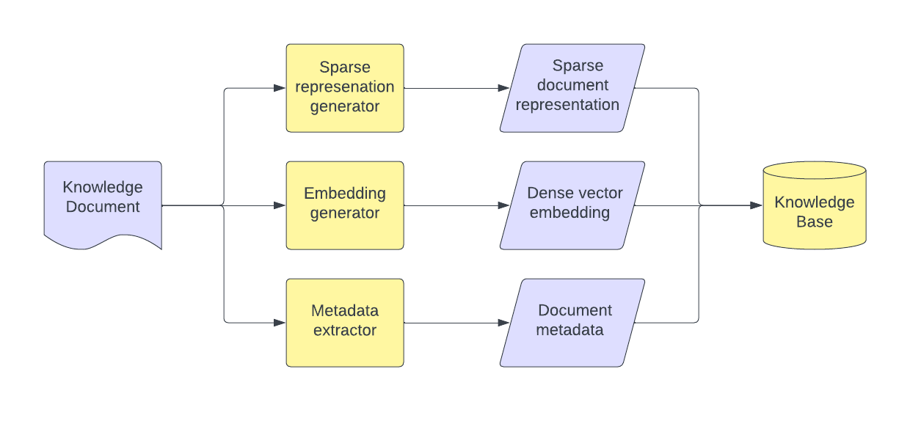
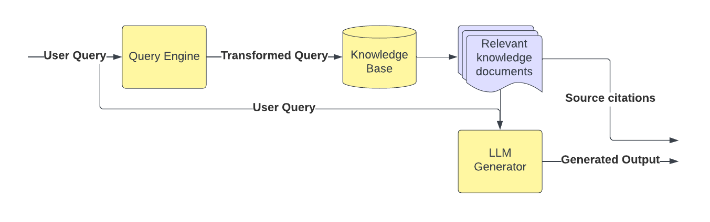

# Retrieval-Augmented Generation (RAG)

## Intent

Improve the performance of LLMs on knowledge-intensive tasks by combining them with a knowledge retriever.

## Motivation

### Knowledge Intensive Task

Knowledge-intensive tasks are those that require a deep understanding of facts and contextual information to provide
accurate and meaningful responses. Retrieval-Augmented Generation (RAG) pattern can be particularly useful for such
tasks as they combine pre-trained parametric models (like LLMs) with non-parametric memory (like dense vector indexes of
large-scale knowledge sources) to enhance the model's ability to access factual knowledge.

### Traditional LLM Limitations on Knowledge Intensive Tasks

When it comes to knowledge-intensive tasks, traditional LLMs still exhibit certain limitations that hinder their overall
effectiveness.

1. **Incomplete and Static Knowledge:** LLMs have limited and outdated knowledge due to their pre-training process.

2. **Inaccurate Knowledge Retrieval:** LLMs may generate text that is contextually incorrect or not fully aligned with
   the given facts, particularly when addressing questions or generating content that requires deep understanding.

3. **Lack of Provenance:** Traditional LLMs do not provide clear sources for the factual knowledge they utilize, which
   makes the generated content lose some credibility.

4. **Difficulty in Updating Knowledge:** Updating knowledge stored in LLMs is computationally expensive and
   time-consuming as it mostly requires retraining.

Given these limitations, traditional LLMs tend to under perform on knowledge-intensive tasks compared to task-specific
architectures, which are specifically designed to access and manipulate external knowledge sources.

[comment]: <> (### Fundamental Need)

## Structure



### Embedding Generator

The main role of the embedding generator is to convert input text (e.g., either an input document or end user query)
into a continuous dense vector representation. This is typically achieved by using a pre-trained neural encoder, which
has been trained to understand the semantic relationships between different pieces of text.

* For large size documents, the embedding generator can be used to generate embeddings for smaller chunks of the
  document. This can be done by using sliding windows or by using a sentence tokenizer. All the chunks together in a
  list paradigm would then represent the original document.

* Some embedding generators are multi-modal and can also take images/audio as input and would generate the embeddings in
  the same vector space as the text.

### Knowledge Base

The Knowledge Base is a fundamental component of the Retrieval-Augmented Generation (RAG) design pattern, serving as the
external, non-parametric memory that stores a vast amount of factual information. The primary role of the Knowledge Base
is to supply the RAG model with a wealth of accurate, up-to-date information that can be used to augment its responses
in knowledge-intensive tasks

* During the indexing phase, the document embeddings(sparse, dense or both) along with other metadata are stored in the
  knowledge base.
* During the retrieval phase, the user query is converted into the same vector space as the documents that were indexed
  using the embedding generator. The query is then fired against the knowledge base to retrieve the most relevant
  documents.
* The knowledge base can be a database that supports dense or sparse vector search inherently.
* The knowledge base should be indexed in a way that it can support queries that are in the same vector space as the
  documents that were indexed efficiently.
* Modern vector DBs are supporting hybrid queries (ex.vector search + plain text search), which required firing queries
  on multiple databases before.



### Query Engine

The main role of the query engine is to convert the end user query into the same vector space as the documents that were
indexed into the knowledge base.

* The query engine can use the same embedding generator that was used to index the documents into the knowledge base.
* The query engine may run various transformations on the query like query disambiguation, query expansion, HyDE, etc.
  before embedding it to improve the retrieval performance. These transformations might use an LLM themselves.
* The query engine finally fires the retrieval query into the knowledge base to retrieve the most relevant documents.

### LLM Generator

The LLM generator is responsible for generating the final response to the end user query. It takes the retrieved
documents, and the original query as input and generates the response.

* The LLM generator may truncate the documents to a certain length before feeding them into the LLM depending on the LLM
  input length restrictions. The LLM generator may also iterate over the documents and generate multiple responses.
* The LLM generator may also use the original query to generate the response. This is particularly useful when the
  retrieved documents are not relevant to the query (which can be filtered using similarity threshold metrics).
* The LLM generator may also use the retrieved documents as citations to provide provenance for the generated response.
* LLM Generator might use a different LLM than the one used for indexing the documents into the knowledge base. This
  LLM might be fine-tuned on a downstream task or might be a different pre-trained LLM altogether.

## Implementation and Relevant Tools

* llama_index https://github.com/jerryjliu/llama_index (previously gpt_index) does a great job of implementing the RAG
  pattern.
* Most common sparse vector representation is tf-idf. Some KBs have internal sparse indexes using custom analyzers (for
  example, Elasticsearch)
* Some common dense vector representations are generated using word2vec, fasttext, Bert and GPT-3.
* Using databases that support dense vector search can be very useful for implementing the RAG pattern. Some examples
  are Pinecone and Weaviate.
* LLM generator is expected to transform the original query, and the retrieved documents into a template prompt that can
  be fed into the LLM for generating the response. The prompt used here can be engineered to limit the LLM from using
  prior knowledge for answering the query.
* The retrieved documents can be used as citations to provide provenance for the generated response.

### Sample LLM Prompt Template

```python
PROMPT_TMPL = (
    "Context information is below. \n"
    "---------------------\n"
    "{context_str}"
    "\n---------------------\n"
    "Assess if the context information is relevant and accordingly answer the question: {query_str}\n"
)

PROMPT_TMPL_TO_LIMIT_PRIOR_KNOWLEDGE = (
    "Context information is below. \n"
    "---------------------\n"
    "{context_str}"
    "\n---------------------\n"
    "Given only the context information and not any prior knowledge, "
    "answer the question factually: {query_str}\n"
)

PROMPT_TMPL_TO_SUMMARIZE = (
    "Context information is below. \n"
    "---------------------\n"
    "{context_str}"
    "\n---------------------\n"
    "Summarize the above context to refine knowledge about this query: {query_str}\n"
)
```

### Sample Code

```python
from llama_index import GPTVectorStoreIndex, SimpleDirectoryReader

# Reading documents from the data directory. 
# The example assumes that the data directory contains the html from http://paulgraham.com/worked.html
documents = SimpleDirectoryReader('data').load_data()
# Ingesting documents into an in memory knowledge base. 
# GPTVectorStoreIndex has a default openai embedding generator that generates dense 
# vectors for the documents before indexing them into a simple dictionary index.
index = GPTVectorStoreIndex.from_documents(documents)
query_engine = index.as_query_engine()
# The query engine internally first uses the same embedding generator to generate a dense vector for the input query
# and then queries the index for the most similar documents to the query vector.
# The query engine then embeds the retrieved documents and the query into a template prompt and feeds it to the LLM.
# The LLM then generates a response to the query which is returned by the query engine.
response = query_engine.query("What did the author do growing up?")
print(response)
```

## Consequences

### Results

1. Improved performance on knowledge-intensive tasks

2. More control on specific vs diverse vs factual language generation

3. Provenance for generated content

### Trade-offs

1. **Latency** : Considerably higher latency than simple LLM calls as it involves query embedding generation, document
   retrieval from KB and final LLM inference.
2. **Costs** : Higher costs for the additional components like vectorDB, embedding-model-calls involved in the RAG
   pattern.
3. **Complexity** : Higher management/dev complexity in terms of the number of components involved, and the number of
   calls between them. Also makes the evaluation of the system more complex.
4. **Dependency on external knowledge sources** : The performance of the RAG pattern is highly dependent on the quality
   of the knowledge base used.

## Known Uses

1. **Fact-based Text Generation:** Generating text that requires incorporating accurate factual information, like
   writing a summary of an event, creating an informative article, or producing a detailed description of a specific
   topic.

2. **Conversational AI:** Building chatbots or virtual assistants that can provide detailed and accurate responses (
   likely from a KnowledgeBase) in natural language conversations, demonstrating an understanding of context and factual
   knowledge.

3. **Open-domain Question Answering (QA):** Answering questions that span a wide range of topics and require access to a
   vast knowledge base, such as answering questions about history, science, literature, or general trivia.

4. **Knowledge Base Population:** Automatically populating a knowledge base with new entities and relationships by
   extracting and synthesizing information from multiple sources, such as web pages, news articles, or scientific
   papers.

[comment]: <> (## Related Patterns)