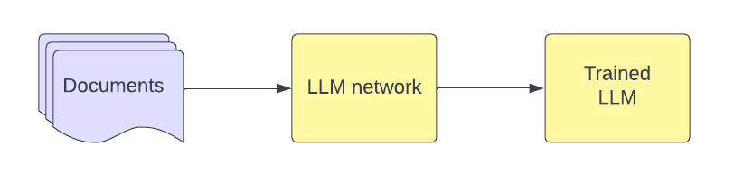
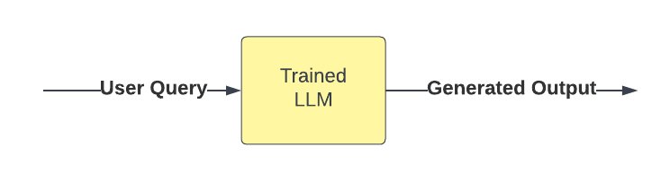

# (WIP) LLM Generation

## Intent

Capture the foundational process of generating text or performing tasks using a large language model (LLM).

## Motivation

Base LLM generation is an essential building block for more complex and specialized design patterns. It serves as the
starting point for designing and building customized, powerful, and efficient applications using LLMs.

Use the base LLM generation design pattern when:

1. You need a foundation for building more complex LLM-based applications.
2. You want to leverage the AI paradigm shift from task-specific models to task-general models.
3. You want to generate text, answer questions, or perform basic tasks using an LLM.
4. You aim to familiarize yourself with the core functionalities of an LLM.

## Structure

*Provide a graphical representation of the pattern. High level diagrams may be used for this purpose. You can include an
image like in the "Diagram" section.*

### Diagram



1. **Documents:** A collection of text documents that serve as the training data for the LLM.
2. **LLM network:** The large language model architecture with some initialized weights prior to training.
3. **Trained LLM:** The large language model with updated weights after training.



1. **User Query:** An input text prompt, which serves as the basis for the LLM's response.
2. **Trained LLM:** The large language model that processes the input and generates the output.
3. **Generated Output:** The generated text or task result based on the input and the LLM's training data.

## Implementation and Relevant Tools

1. **Prompt:** Prepare a text prompt that captures the desired task or question for the LLM.
2. **Tokenization:** Convert the input prompt into a sequence of tokens compatible with the LLM.
3. **Model Selection:** Choose the appropriate LLM based on the task complexity and required performance.
4. **Model Configuration:** Set the LLM's parameters, such as maximum token length, temperature, and top-k sampling.
5. **Generation:** Feed the tokenized input into the LLM and obtain the generated output.
6. **Post-Processing:** Convert the output tokens back into human-readable text and perform any necessary
   post-processing.

### Sample Code

```python
from transformers import GPT2LMHeadModel, GPT2Tokenizer


def generate_text(prompt, max_tokens=100, top_k=10, model_name="gpt2"):
    # Load the pre-trained GPT-2 model and tokenizer
    model = GPT2LMHeadModel.from_pretrained(model_name)
    tokenizer = GPT2Tokenizer.from_pretrained(model_name)

    # Tokenize the input prompt
    input_ids = tokenizer.encode(prompt, return_tensors="pt")

    # Generate text
    output = model.generate(
        input_ids,
        max_length=len(input_ids[0]) + max_tokens,
        num_return_sequences=1,
        do_sample=True,
        top_k=top_k,
    )

    # Decode the generated text
    generated_text = tokenizer.decode(output[0], skip_special_tokens=True)

    return generated_text


prompt = "Once upon a time in a land far, far away,"
generated_text = generate_text(prompt, max_tokens=50, top_k=50)
print(generated_text)
```

## Consequences

This section discusses the results achieved with the base LLM generation design pattern, and the trade-offs that arise
from using this pattern.

### Results

1. **Versatility**: Leverage the task-general nature of LLMs to perform a wide range of tasks without the need for
   task-specific training.
2. **Emergent abilities**: Benefit from the emergent abilities of large language models, such as arithmetic, taking
   college-level exams, and identifying the intended meaning of words.
3. **Adaptability**: Use various prompting strategies that become available with sufficiently large language models,
   enhancing their capabilities.
4. **Foundation**: Establish a solid foundation for building more complex and specialized LLM-based applications and
   design patterns.

### Trade-offs

1. **Computation cost**: Large language models can be computationally expensive, both in terms of processing time and
   memory usage, especially when generating longer text sequences.
2. **API cost**: When using API-based language models, the cost is usually determined by the number of tokens processed.
   Generating longer outputs or more frequent requests can increase the cost of using the API.
3. **Output control**: While LLMs can be highly versatile, they may sometimes generate outputs that are not as focused
   or specific as desired, requiring additional post-processing or filtering.
4. **Parameter tuning**: Finding the optimal balance between performance and output quality may require careful tuning
   of parameters like `max_tokens` and `top_k`.
    1. **Max tokens**: The maximum number of tokens to generate. Increasing this value can lead to longer outputs but
       also increases the memory usage, latency and hence the cost. Do note that it does not provide direct guidance to
       the model to tailor the answer concisely. Instead, it acts as a hard constraint on the output length.
    2. **Top-k**: The number of top tokens to consider for sampling. Increasing this value can lead to more diverse
       outputs but also increases the risk of generating hallucinations.
5. **Hallucination and evaluation**: Large language models may sometimes generate text that appears coherent and
   confident but is incorrect or unrelated to the input prompt (hallucination). This can make it challenging to evaluate
   the accuracy and reliability of the generated outputs, as the model might produce plausible-sounding but incorrect
   information.

## Some Uses

The base LLM generation design pattern has been used in a variety of applications and problem domains. Some known uses
include:

1. **Text completion**: Generating text that completes a given prompt, such as writing an essay or composing an email
   based on an initial sentence or paragraph.
2. **Question answering**: Providing answers to user questions by interpreting the input prompt as a question and
   generating an appropriate response.
3. **Translation**: Translating text from one language to another by framing the translation task as a next-word
   prediction problem.
4. **Summarization**: Generating concise summaries of longer pieces of text by prompting the model to produce a brief
   overview of the input content.
5. **Paraphrasing**: Rewriting a given text in different words while preserving the original meaning, which can be
   useful for creating variations of existing content or improving readability.
6. **Code generation**: Generating programming code based on a given prompt, such as converting a natural language
   description of a function into actual code.
7. **Text-based games**: Developing interactive text-based games or simulations where the LLM responds to user input and
   drives the narrative or game progression.
8. **Conversational AI**: Building chatbots or virtual assistants that can engage in natural language conversations with
   users and provide relevant information or assistance.

The base LLM generation design pattern is highly versatile and can be used as a foundation for many applications and
tasks, addressing a broad range of problems in various domains.


